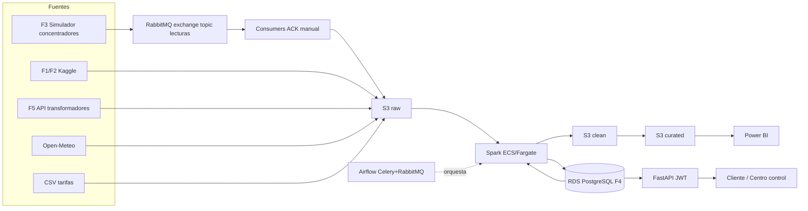

# README TÉCNICO — VoltiaGrid API (guía de estudio P1)

> Propósito: estudiar y presentar con dialecto técnico la arquitectura del proyecto y todo lo implementado en la **US-01 (Seed reproducible del inventario de red, F4)**. Alcance P1. No sustituye las ADRs formales de `voltiagrid-docs` (P4) ni el dimensionamiento de infra de P3.

## 0. Elevator pitch técnico (2 minutos)

> "VoltiaGrid ingiere lecturas de medidores cada 30 minutos por RabbitMQ con ACK manual, las persiste en crudo en S3, las procesa con Spark (limpieza, deduplicación por secuencia, estimación de huecos, franjas tarifarias, pérdidas por transformador y liquidación de eventos), las orquesta con Airflow, las expone con FastAPI (JWT, p95 ≤ 500 ms) y las analiza con un modelo dimensional en Power BI. La base operativa es PostgreSQL/RDS con el inventario de red F4. Mi entrega US-01 deja ese inventario determinista: misma semilla → mismos datos, sin duplicados, con modos dev/full, topología 50–80 medidores por transformador y prueba CT-06 por hash MD5."

Términos que el TL espera oír: **idempotencia, clave natural, upsert (`ON CONFLICT`), RNG aislado, determinismo, trazabilidad AC→test→código, migración versionada, transacción + rollback en tests, `DATABASE_URL` portable**.

---

## 1. Arquitectura end-to-end (lo que presentas el lunes)



### Reparto por rol (qué presenta quién)

| Rol | Dominio | Estado |
|---|---|---|
| P1 (tú) | Ingesta F3, RabbitMQ, APIs, simuladores F3/F5, **Seed F4 US-01 ✅** | US-01 lista; resto en próximas USs |
| P2 | Spark, Data Lake raw/clean/curated, RN-01 a RN-10 | Diseño pendiente de confirmar |
| P3 | VPC, ECS/Fargate, EKS, RDS, S3, ALB, MWAA/Airflow, CI/CD, observabilidad, **costos** | Diseño pendiente de confirmar |
| P4 | Modelo dimensional, Power BI (6 preguntas), ADRs formales, runbooks | Diseño pendiente de confirmar |

### Estado real de la arquitectura

- **Implementado (código + tests):** ERD F4, modelos SQLAlchemy, migraciones Alembic, seed (network + F1 + upsert + CLI), tests (upsert + reproducibilidad), `docker-compose` Postgres, `docs/erd.md`.
- **Diseñado en README (sin código aún):** F3/F5 simuladores, RabbitMQ (exchange `lecturas`, routing keys `lecturas.vivo`/`lecturas.reenvio`, DLQ, publisher confirms), FastAPI (cliente + centro control), Spark, Airflow, S3, AWS, Power BI.
- **Conclusión para el lunes:** presenta US-01 como "fundación verificada" y el resto como "arquitectura objetivo con decisiones por cerrar".

---

## 2. US-01 en profundidad técnica

### 2.1 AC1 — Reproducibilidad (misma semilla → datos idénticos, 0 duplicados)

**Definición operativa:** BD vacía + `SEED=42` + `DEFECT_RATE=0` + 2 ejecuciones ⇒ `md5` por tabla idéntico y `COUNT(*)` estable.

**Mecanismos (3 capas):**

1. **Determinismo en generación:**
   - `rng = random.Random(settings.seed)` (instancia aislada, nunca `random.seed()` global).
   - `select_households`: `sorted(rows, key=LCLid)[:N]` ⇒ `dev` es prefijo ordenado de `full`.
   - Códigos por regla fija: `CU-{LCLid}`, `CT-{LCLid}-1`, `TR-%05d`, `CT-%03d`.
   - Capacidades pseudoaleatorias acotadas: TX 100–500 kVA, CT 1000–5000 kVA vía `_random_decimal(rng, min, max)`.
   - Prohibido: `uuid4()`, `datetime.now()`, `created_at`, `set` sin ordenar.
2. **Idempotencia en escritura:**
   - `upsert_by_natural_key(session, model, records, natural_key, update_fields?, fk_resolver?)`.
   - `Circuit/Transformer/Customer/Contract` → `ON CONFLICT (code) DO NOTHING`.
   - `Meter` → `ON CONFLICT (lclid) DO UPDATE SET transformer_id, customer_id`.
3. **Verificación por hash (CT-06):**
   ```sql
   SELECT md5(string_agg(row_hash, '' ORDER BY code))
   FROM (
     SELECT md5(concat_ws('|', id, code, capacity_kva)) AS row_hash, code
     FROM circuit
   ) t;
   ```
   Implementado en `tests/test_reproducibility.py::compute_table_hash` + `test_seed_reproducibility` (2 corridas, 5 tablas).

**Cómo decirlo en la presentación:** "AC1 se garantiza en generación con RNG aislado y claves naturales deterministas, en escritura con upsert por conflicto, y se prueba con hash MD5 ordenado por clave natural en dos corridas."

### 2.2 AC2 — Modos de volumen (`dev`=200, `full`=5500)

- `seed/config.py`: `METERS_BY_MODE = {"dev": 200, "full": 5500}`, dataclass inmutable `SeedSettings`.
- Precedencia: CLI (`--mode`) > env (`MODE`) > default (`dev`). Igual para `SEED` (default 42), `DEFECT_RATE` (default 0.02, validado 0–1), `DATABASE_URL` (sin default; error si falta).
- Comando: `python -m seed --mode dev --seed 42 --defect-rate 0`.

### 2.3 AC3 — Coherencia de red (LCLid válido; 50–80 por transformador)

- Fuente: `data/raw/informations_households.csv` (`csv.DictReader`, `utf-8-sig`).
- `TARIFF_BY_CODE = {"Std": "standard", "ToU": "dynamic"}`; error si código desconocido.
- `normalize_acorn("ACORN-") → "UNKNOWN"`; `normalize_grouped` fuera de `{Affluent, Comfortable, Adversity}` → `"Unknown"` (coherente con `CHECK`).
- `plan_network(rng, sorted_lclids)`:
  1. Bloques contiguos: `count = rng.randint(50, 80)` (recortado al resto final).
  2. `meter_to_transformer: {lclid: TR-xxxxx}`.
  3. Agrupación: `rng.randint(5, 10)` transformadores por circuito.
- `build_meter(row, transformer_code)` añade `transformer_code`; luego `_resolve_fks` lo convierte a `transformer_id` consultando la BD.
- Verificación: `test_meter_counts_per_transformer_range` (todos menos el último en 50–80; suma = N), `\d customer`, `SELECT t.code, COUNT(m.id) ... GROUP BY`.

### 2.4 AC4 — Portabilidad (`DATABASE_URL`)

- Mismo código para local y RDS; solo cambia `DATABASE_URL` (env o `--database-url`).
- Local: `docker compose up -d` (Postgres 16, `5433:5432`, volumen `pgdata`, healthcheck `pg_isready` cada 5 s × 10).
- `.env.example`: `SEED`, `MODE`, `DEFECT_RATE`, `DATABASE_URL` sin secretos (CT-02).
- Tests usan la misma `DATABASE_URL` (`tests/conftest.py`).

---

## 3. Modelo de datos F4 (dialecto técnico)

Ver `docs/erd.md` y `app/models/inventory.py`. Convención de nombres en `app/models/base.py`: `ix_`, `uq_<tabla>_<col>`, `ck_<tabla>_<constraint>`, `fk_<tabla>_<col>_<ref>`, `pk_<tabla>`.

| Tabla | PK | Clave natural (UK) | FKs (indexadas) | Constraints | Uso en reglas |
|---|---|---|---|---|---|
| `circuit` | `id` | `code VARCHAR(20)` | — | `CHECK (capacity_kva > 0)` | RN-08: carga proyectada > 85% capacidad |
| `transformer` | `id` | `code VARCHAR(20)` | `circuit_id → circuit.id` | `CHECK (capacity_kva > 0)` | RN-06: pérdidas = entregada − suma medidores; >12% 3 días ⇒ sospechoso |
| `customer` | `id` | `code VARCHAR(30)` (`CU-{LCLid}`) | — | `CHECK (acorn_grouped IN (...))` | Segmentación ACORN en tablero |
| `contract` | `id` | `code VARCHAR(40)` (`CT-{LCLid}-1`) | `customer_id → customer.id` | `CHECK (tariff_type IN ('standard','dynamic'))` | RN-07 necesita saber cambio de contrato |
| `meter` | `id` | `lclid VARCHAR(20)` | `customer_id`, `transformer_id` | — | 1 medidor ↔ 1 cliente (piloto); N medidores ↔ 1 TX |

**Migraciones:**
- `350a6529f67d_create_inventory_tables.py`: creación inicial.
- `cb10f7277f53_add_acorn_grouped_to_customer.py`: añade `acorn_grouped VARCHAR(20) NOT NULL` + `CHECK`. Nota técnica: Alembic autogenerate solo detectó la columna; el `CHECK` se agregó a mano en `upgrade()` (`op.create_check_constraint`) y se revierte en orden inverso en `downgrade()` (`drop_constraint` → `drop_column`). Tabla vacía ⇒ columna `NOT NULL` sin default es aceptada por Postgres; con filas habría fallado.

---

## 4. Pipeline del seed (para explicar línea por línea)

```
CSV → read_households → select_households(sorted LCLid, [:N])
  → lclids → plan_network(rng, lclids) → NetworkPlan
  → seed_f1_households(rows, meter_to_tx) → customers/contracts/meters (con *_code)
  → upserts: circuits → transformers[+flush] → customers → contracts[+flush] → meters → commit
```

- `seed/network.py`: `NetworkPlan`, `build_circuit`, `build_transformer`, `plan_network`.
- `seed/f1.py`: `read_households`, `select_households`, `map_tariff`, `normalize_acorn/grouped`, `build_customer/contract/meter`.
- `seed/upsert.py`: `upsert_by_natural_key` (genérica, `pg_insert`, `fk_resolver` opcional).
- `seed/__main__.py`: `build_parser`, `_rng_from_seed`, `_resolve_transformer_fks/_resolve_contract_fks/_resolve_fks`, `main`.
- Orden de `flush`/`commit`: circuitos y transformadores primero (destinos FK), luego clientes/contratos, al final medidores.

---

## 5. Testing (qué decir si preguntan "¿cómo lo prueban?")

- Fixture `tests/conftest.py`: `engine` (sesión) + `session` (conexión + transacción + `yield` + `rollback`). Aislamiento sin recrear BD.
- `tests/test_upsert.py` (7 tests): `DO NOTHING` circuit/transformer/customer, `DO UPDATE` meter, integridad FK, idempotencia por entidad, determinismo RNG, rango 50–80.
- `tests/test_reproducibility.py` (CT-06): 2 corridas `seed_main()` con `seed=42, mode=dev, defect_rate=0.0`; hash MD5 por tabla ordenado por clave natural; `assert` igualdad en las 5 tablas.
- Ejecución en Docker (Windows bloquea `psycopg` por Application Control):
  ```bash
  docker run --rm --network host -v "<ruta>/voltiagrid-api:/app" -w /app python:3.12-slim bash -c "pip install -r requirements.txt -q && python -m pytest tests/ -v"
  ```

---

## 6. ADRs de US-01 (versión para exponer)

1. **ORM + migraciones:** SQLAlchemy 2.0 + Alembic ⇒ mismo esquema local/RDS, versionado. Costo: el `CHECK` no se autogenera, se mantiene a mano.
2. **Upsert por clave natural:** `INSERT ... ON CONFLICT` en vez de `merge()` ⇒ idempotencia en BD, re-ejecuciones seguras. `DO NOTHING` para inmutables, `DO UPDATE` solo FKs de `meter`.
3. **RNG aislado:** `random.Random(seed)` ⇒ reproducibilidad aunque otras libs usen `random`.
4. **`network.py` separado de `f1.py`:** topología (algoritmo) vs hogares (CSV) ⇒ reutilización y SRP.
5. **Sin campos no deterministas:** sin `created_at`/`uuid4`/`now()` ⇒ hash estable, `dev` subconjunto de `full`.
6. **Tests con rollback:** transacción por test ⇒ aislamiento, rapidez, misma `DATABASE_URL`.
7. **Capacidades en rangos:** TX 100–500, CT 1000–5000 kVA ⇒ plausibles sin dataset externo, deterministas por RNG.

---

## 7. Glosario ampliado (estudio)

Ver sección 13 del README. Añade para la presentación: **idempotencia** (re-ejecutar no cambia el resultado), **determinismo** (misma entrada + semilla ⇒ misma salida), **clave natural vs subrogada** (`code`/`lclid` vs `id`), **conflicto** (violación de `UNIQUE`), **`excluded`** (fila propuesta en `ON CONFLICT DO UPDATE`), **flush vs commit** (`flush` envía SQL sin confirmar; `commit` confirma transacción), **healthcheck** (`pg_isready`), **volumen Docker** (`pgdata` persiste datos), **CT-06** (criterio transversal de reproducibilidad), **F4** (inventario), **RN-06/07/08** (pérdidas, sospechosos, demanda).

---

## 8. Base para la reunión de costos (framework, no cifras finales)

> Responsables finales: P3 (infra) + P4 (negocio). Esto es la estructura para que la reunión sea productiva. Validar todo con calculadora AWS y supuestos firmados.

### 8.1 Categorías y drivers

| Categoría | Servicios candidatos | Driver principal | Pregunta para la reunión |
|---|---|---|---|
| Compute API | ECS Fargate (+ ALB), ECR | vCPU/h, GB/h, requests | ¿Tasks mínimas? ¿Auto-scaling por p95 500 ms? |
| Compute datos | ECS Fargate / Fargate Spot (Spark), EKS (1 componente exigido) | vCPU/h por job, duración cierre <45 min | ¿Spot para histórico? ¿On-demand para diario? |
| Orquestación | MWAA vs Airflow self-hosted (ECS + Celery + RabbitMQ) | entorno/h, workers | ¿MWAA (gestionado) o propio (más barato, más ops)? |
| Mensajería | RabbitMQ en EC2/ECS vs Amazon MQ | instancia/h, throughput | 264k/día hoy → 9.6M/día (200k). ¿Cuándo migrar a Kafka? |
| Base datos | RDS PostgreSQL (+ Multi-AZ?, réplicas lectura) | instancia/h, GB, IOPS | ¿Tamaño inventario + resultados? ¿PITR? |
| Data Lake | S3 raw/clean/curated (3 años) | GB/mes por clase, requests | ¿Lifecycle: Standard → IA → Glacier? ¿Partición por fecha? |
| Red | VPC, ALB, NAT Gateway, Data Transfer | hora + GB | ¿Multi-AZ? ¿Endpoints VPC para S3/ECR? |
| Observabilidad | CloudWatch Logs/Metrics/Alarmas, X-Ray | ingestión GB, métricas, retención | ¿Nivel de log? ¿Alarma CT-09 cuál? |
| CI/CD | GitHub Actions / CodePipeline, ECR | minutos, almacenamiento | ¿Frecuencia deploys? ¿Secret scanning? |

### 8.2 Cálculo por escenarios (plantilla)

| Escenario | Medidores | Lecturas/día | Qué dimensionar |
|---|---|---|---|
| Piloto | 5.500 | 264.000 | 1 AZ basta para dev; RDS pequeño; Fargate mínimo |
| Proyectado | 200.000 (×36) | 9.600.000 | Multi-AZ, ALB, workers Airflow, S3 lifecycle agresivo |
| Pico reenvío CA-08 | +1.000 (48.000 de golpe) | — | Cola `lecturas.reenvio` separada; escalar consumidores temporalmente |

### 8.3 Optimizaciones para proponer

- Fargate Spot para Spark histórico; on-demand/Fargate para cierre diario crítico.
- S3 Intelligent-Tiering o lifecycle a IA (30 d) → Glacier (90 d) para 3 años.
- Reserved Instances / Savings Plans para RDS y RabbitMQ si uso estable.
- VPC Endpoints (S3, ECR) para evitar NAT/Data Transfer.
- Compresión Parquet + partición por fecha (menos escaneo, menos costo Spark/S3).
- Retención de logs acotada + métricas agregadas.

### 8.4 Riesgos de costo (decir en voz alta)

- Data Transfer inter-AZ y salida a Internet (Power BI, Open-Meteo).
- RDS sin Multi-AZ en prod ⇒ riesgo disponibilidad; con Multi-AZ ⇒ costo ×2 aprox.
- RabbitMQ como cuello de botella en reenvíos (48k de golpe) ⇒ sobredimensionar o DLQ bien diseñada.
- Retención 3 años sin lifecycle ⇒ S3 Standard caro.

### 8.5 Checklist para salir de la reunión con decisiones

- [ ] Supuestos firmados: AZs, retención, crecimiento, SLA.
- [ ] Elecciones: MWAA vs propio, MQ vs self-hosted, Multi-AZ sí/no.
- [ ] Estrategia tagging (proyecto/ambiente/responsable) para cost allocation.
- [ ] Dueño del cost model y fecha de revisión con números de calculadora AWS.

---

## 9. Script de presentación sugerido (P1, 5 minutos)

1. **(30 s)** Contexto: "F4 es la verdad operativa: sin inventario determinista, Spark no puede calcular pérdidas por transformador."
2. **(1 min)** Demo mental: "`--seed 42 --mode dev` crea 200 medidores; `--mode full` 5500; segunda corrida 0 duplicados."
3. **(1 min)** Arquitectura seed: muestra el Mermaid del pipeline + orden de upserts + resolvers FK.
4. **(1 min)** CT-06: explica el hash MD5 ordenado por clave natural en 2 corridas + `pytest` en verde.
5. **(1 min)** Decisiones: RNG aislado, upsert por clave natural, sin `created_at`. Cierra: "US-01 deja la fundación verificada; P2/P3/P4 construyen encima."

**Frases técnicas para sonar sólido:**
- "La idempotencia está en la base de datos, no en memoria: `ON CONFLICT`."
- "El determinismo está en tres capas: generación, escritura y verificación."
- "`dev` es prefijo ordenado de `full`, así comparamos resultados entre modos."
- "Los tests usan transacción con rollback: aislamiento sin recrear la base."

---

## 10. FAQ técnico probable (con respuestas cortas)

**¿Por qué no `session.merge()`?** Porque `merge()` hace SELECT+INSERT/UPDATE por objeto (lento) y no es atómico en lote; `pg_insert(...).on_conflict_*` es una sola sentencia, atómica y rápida.

**¿Por qué `DO UPDATE` solo en `meter`?** Circuit/transformer/customer/contract son inmutables en el seed; `meter` puede cambiar de TX/cliente entre topologías y debe reflejarlo.

**¿Por qué el último transformador puede tener <50?** Es el resto: 200 no es múltiplo de bloques 50–80. El test lo permite solo para el último.

**¿Por qué Alembic no detectó el `CHECK`?** Autogenerate compara columnas/tipos, no constraints personalizados; por eso se añade `create_check_constraint` a mano.

**¿Por qué Docker para tests en Windows?** `psycopg`/`psycopg-binary` son bloqueados por Application Control; en `python:3.12-slim` con `--network host` sí conectan a Postgres local.

**¿Qué pasa si `DATABASE_URL` apunta a RDS?** Mismo código, misma migración (`alembic upgrade head`), mismo seed. Solo cambian credenciales/red (Security Groups).

---

## 11. Trazabilidad completa US-01

| Tarea | Rama / Commit | Archivos | AC |
|---|---|---|---|
| T-01.1 ERD | `feature/KAN-10-inventory-erd` | `docs/erd.md` | AC3 |
| T-01.2 Modelos+Migraciones | `feature/KAN-11-orm-models-migrations` | `app/models/*`, `migrations/versions/*` | AC1, AC3 |
| T-01.3 Clientes/medidores F1 | `feature/KAN-12-generate-customers-meters` | `seed/f1.py`, `Customer.acorn_grouped` + migración | AC3 |
| T-01.4 Red 50–80 | `KAN-13-...` | `seed/network.py` | AC3 |
| T-01.5 Upsert | `KAN-14-...` | `seed/upsert.py`, refactor `seed/__main__.py`, `tests/*`, `.gitignore` | AC1 |
| T-01.6 CLI/env | `feature/KAN-15-seed-cli-parameters` | `seed/config.py`, `seed/__main__.py`, `.env.example` | AC2, AC4 |
| T-01.7 Hash CT-06 | `KAN-16-...` | `tests/test_reproducibility.py` | AC1 |

Verificación rápida hoy:
```bash
docker compose ps  # db healthy
alembic upgrade head
python -m seed --mode dev --seed 42 --defect-rate 0  # en Docker si hace falta
docker run ... python -m pytest tests/ -v
```
