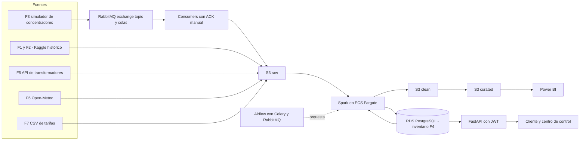

<h1 align="center">VoltaGrid — Medición Inteligente</h1>

<p align="center">
  <a href="README.es.md">🇪🇸 Español</a> | <a href="README.md">🇺🇸 English</a>
</p>

<p align="center">
  <a href="https://www.python.org/"></a>
  <a href="https://fastapi.tiangolo.com/"></a>
  <a href="https://www.postgresql.org/"></a>
  <a href="https://www.rabbitmq.com/"></a>
  <a href="https://www.docker.com/"></a>
  <a href="https://www.conventionalcommits.org/"></a>
</p>

---

<p align="center">
  Plataforma de datos para Voltia Energía S.A. E.S.P. (comercializadora ficticia, 1,2M de clientes).<br>
  Recibe lecturas de medidores inteligentes cada 30 minutos, las limpia y completa, calcula el consumo por franja tarifaria, detecta pérdidas y fraude por transformador y gestiona eventos de respuesta a la demanda — todo servido en un tablero de Power BI y una demo en vivo en AWS.
</p>

> Estado del documento: borrador. Lo marcado como **(propuesta)** o **(por decidir)** aún no está acordado con el equipo. Cada decisión cerrada se documenta como ADR en `voltiagrid-docs`.

---

## Tabla de Contenido

- [Categorías del Proyecto](#categorías-del-proyecto)
- [Tecnologías y otros](#tecnologías-y-otros)
- [Arquitectura](#arquitectura)
- [Fuentes de datos](#fuentes-de-datos)
- [Estructura](#estructura)
- [Inicio Rápido](#inicio-rápido)
- [Testing](#testing)
- [Equipo](#equipo)
- [Documentación](#documentación)
- [Contribuir](#contribuir)

---

## Categorías del Proyecto

- **Facturación** — facturar al 99% de los clientes piloto con lecturas reales por franja (RN-03, RN-04, RN-05).
- **Pérdidas y fraude** — localizar el 70% de las pérdidas no técnicas a nivel de transformador (RN-06, RN-07).
- **Respuesta a la demanda** — ejecutar eventos y medir el ahorro real (RN-08, RN-09, RN-10).

Escala: 5.500 medidores piloto (264.000 lecturas/día) → 200.000 medidores proyectados (9.600.000 lecturas/día, 36x).

## Tecnologías y otros

<div align="center">

### Build & Tooling

<p>
  <a href="https://www.python.org/"></a>
  <a href="https://www.docker.com/"></a>
  <a href="https://git-scm.com/"></a>
</p>

### Backend (este repo)

<p>
  <a href="https://fastapi.tiangolo.com/"></a>
  <a href="https://www.sqlalchemy.org/"></a>
  <a href="https://alembic.sqlalchemy.org/"></a>
  <a href="https://www.postgresql.org/"></a>
  <a href="https://www.rabbitmq.com/"></a>
</p>

### Datos y nube (repos hermanos)

<p>
  <a href="https://spark.apache.org/"></a>
  <a href="https://airflow.apache.org/"></a>
  <a href="https://aws.amazon.com/s3/"></a>
  <a href="https://aws.amazon.com/ecs/"></a>
  <a href="https://powerbi.microsoft.com/"></a>
</p>

</div>

## Arquitectura



Orden de lectura: **generar → ingerir (RabbitMQ, colas persistentes, ACK manual) → procesar (Spark) → orquestar (Airflow) → exponer (FastAPI) → analizar (Power BI)**. La limpieza de negocio (deduplicación RN-02) se hace en Spark, nunca en el consumidor, para no perder el dato crudo.

## Fuentes de datos

| ID | Fuente | Tipo | Frecuencia |
|---|---|---|---|
| F1 | Smart meters in London (Kaggle), ~5.500 hogares, ~167M lecturas | CSV real | Histórico único |
| F2 | Clima histórico del mismo dataset | CSV real | Histórico, horario |
| F3 | Lecturas de concentradores (JSON por lote de medidores) | Stream simulado | Cada 30 min |
| F4 | Inventario de red: clientes, medidores, transformadores, circuitos, contratos | PostgreSQL simulada (seed) | Diaria |
| F5 | Energía entregada por transformador (~100 en piloto) | API REST simulada | Cada 15 min |
| F6 | Pronóstico de temperatura | API pública Open-Meteo | Horaria |
| F7 | Calendario tarifario (punta, intermedia, valle, precio por kWh) | CSV simulado | Trimestral |

Lo simulado sale de un **seed**: semilla fija, idempotente, volumen parametrizable (`dev`/`full`) y tasa de defectos configurable. Las reglas de negocio completas (RN-01…RN-11) viven en `voltiagrid-docs`; el seed implementa hoy el inventario F4 (US-01).

## Estructura

```
voltiagrid-api/
├── app/
│   ├── api/            # routers FastAPI (cliente y centro de control)
│   ├── services/       # lógica de negocio
│   ├── repositories/   # acceso a base de datos
│   ├── models/         # ORM SQLAlchemy (inventario F4)
│   ├── schemas/        # contratos Pydantic de entrada/salida
│   └── core/           # configuración, seguridad, JWT
├── seed/               # scripts de siembra F4 (red + hogares + upsert + CLI)
├── simulators/         # (planeado) F3 concentradores, F5 API transformadores
├── migrations/         # migraciones versionadas con Alembic
├── tests/              # tests de upsert + reproducibilidad (CT-06)
├── docs/
│   ├── CONTRIBUTING.md      # ramas, commits, PR (EN)
│   ├── CONTRIBUTING.es.md   # mismo contenido en español
│   └── erd.md               # diagrama entidad-relación F4
├── docker-compose.yml
├── Dockerfile
├── .env.example        # variables de ejemplo, sin secretos
├── README.md           # versión en inglés
└── README.es.md        # este archivo (español)
```

API por capas (`routers → services → repositories → models/schemas`) para probar cada capa por separado entre varias personas.

## Inicio Rápido

Objetivo (CT-01): una persona externa levanta todo el stack local en menos de 30 minutos.

```bash
cp .env.example .env
docker compose up -d
alembic upgrade head
python -m seed --mode dev --seed 42 --defect-rate 0
python -m seed --mode dev --seed 42 --defect-rate 0  # 2da corrida: 0 duplicados (idempotente)
```

Tests (Docker recomendado en Windows — `psycopg` puede ser bloqueado por Application Control):

```bash
docker run --rm --network host -v "<ruta>/voltiagrid-api:/app" -w /app python:3.12-slim bash -c "pip install -r requirements.txt -q && python -m pytest tests/ -v"
```

Parámetros del seed (`CLI > env > default`):

| Variable | Qué hace |
|---|---|
| `SEED` | Semilla fija para datos reproducibles (default `42`). |
| `MODE` | `dev` (200 medidores) o `full` (5.500 medidores). |
| `DEFECT_RATE` | Tasa 0–1 de defectos inyectados. Usa `0.0` para comparar hashes. |
| `DATABASE_URL` | PostgreSQL local o RDS — mismo código, sin cambios. |

Ninguna credencial va en el repo ni en las imágenes (CT-02): usa variables de entorno; el CI falla si detecta secretos.

## Testing

| Test | Qué verifica |
|---|---|
| `test_upsert_*` (7 tests) | `DO NOTHING` (circuit/transformer/customer/contract), `DO UPDATE` de FKs (meter), integridad FK, idempotencia por entidad, asignación determinista, 50–80 medidores por transformador |
| `test_seed_reproducibility` (CT-06) | Hash MD5 por tabla idéntico en 2 corridas con misma semilla (`circuit`, `transformer`, `customer`, `contract`, `meter`) |

Reglas de determinismo: RNG aislado (`random.Random(seed)`), LCLids ordenados, códigos deterministas (`TR-%05d`, `CT-%03d`, `CU-{LCLid}`), sin `uuid4()`/`now()`/`created_at`, upsert por clave natural (`ON CONFLICT`), tests con transacción + rollback.

## Equipo

| Rol | Responsabilidad | Integrante / GitHub |
|---|---|---|
| P1 — Backend y mensajería | FastAPI, RabbitMQ, simuladores, API | <!-- TODO: nombre + @github --> |
| P2 — Ingeniería de datos | Spark, reglas de negocio, rendimiento | <!-- TODO: nombre + @github --> |
| P3 — Cloud y DevOps | Docker, AWS, Airflow, CI/CD, EKS | <!-- TODO: nombre + @github --> |
| P4 — Arquitectura y analítica | Docs, ADRs, costos, modelo dimensional, Power BI | <!-- TODO: nombre + @github --> |

Repos de la organización:

| Repo | Contenido |
|---|---|
| `voltiagrid-api` | FastAPI, simuladores, consumidores RabbitMQ, seed (este repo) |
| `voltiagrid-data` | Spark, DAGs de Airflow, reglas de negocio |
| `voltiagrid-analytics` | Modelo dimensional, Power BI |
| `voltiagrid-docs` | Arquitectura completa, ADRs, costos, runbook |

## Documentación

| Idioma | Detalle arquitectura | Guía técnica de estudio | ERD | Spec completa |
|---|---|---|---|---|
| Español | Este README | [README-TECNICO.md](README-TECNICO.md) | [erd.md](docs/erd.md) | `voltiagrid-docs` (P4) |
| Inglés | [README.md](README.md) | — | [erd.md](docs/erd.md) | `voltiagrid-docs` (P4) |

> Detalle completo archivado (ES, pre-reestructuración): [docs/PROJECT-DETAIL.es.md](docs/PROJECT-DETAIL.es.md).

## Contribuir

Ver [CONTRIBUTING.es.md](docs/CONTRIBUTING.es.md) para clon, ramas, commits y PRs (español).

See [CONTRIBUTING.md](docs/CONTRIBUTING.md) for the English guide.
