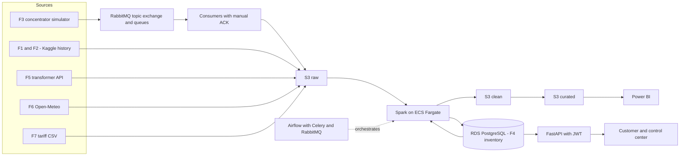

<h1 align="center">VoltaGrid — Smart Metering</h1>

<p align="center">
  <a href="README.es.md">🇪🇸 Español</a> | <a href="README.md">🇺🇸 English</a>
</p>

<p align="center">
  <a href="https://www.python.org/"></a>
  <a href="https://fastapi.tiangolo.com/"></a>
  <a href="https://www.postgresql.org/"></a>
  <a href="https://www.rabbitmq.com/"></a>
  <a href="https://www.docker.com/"></a>
  <a href="https://www.conventionalcommits.org/"></a>
</p>

---

<p align="center">
  Data platform for Voltia Energía S.A. E.S.P. (fictional retailer, 1.2M customers).<br>
  It ingests smart-meter readings every 30 minutes, cleans and fills gaps, computes time-of-use consumption, detects losses and fraud per transformer, and manages demand-response events — served through a Power BI dashboard and a live AWS demo.
</p>

> Document status: draft. Items marked **(proposal)** or **(to be decided)** are not yet agreed with the team. Each closed decision is recorded as an ADR in `voltiagrid-docs`.

---

## Table of Contents

- [Project Categories](#project-categories)
- [Technologies and others](#technologies-and-others)
- [Architecture](#architecture)
- [Data Sources](#data-sources)
- [Structure](#structure)
- [Quick Start](#quick-start)
- [Testing](#testing)
- [Team](#team)
- [Documentation](#documentation)
- [Contributing](#contributing)

---

## Project Categories

- **Billing** — bill 99% of pilot customers with actual per-band readings (RN-03, RN-04, RN-05).
- **Losses & fraud** — locate 70% of non-technical losses at transformer level (RN-06, RN-07).
- **Demand response** — run events and measure real savings (RN-08, RN-09, RN-10).

Scale: 5,500 pilot meters (264,000 readings/day) → 200,000 projected meters (9,600,000 readings/day, 36x).

## Technologies and others

<div align="center">

### Build & Tooling

<p>
  <a href="https://www.python.org/"></a>
  <a href="https://www.docker.com/"></a>
  <a href="https://git-scm.com/"></a>
</p>

### Backend (this repo)

<p>
  <a href="https://fastapi.tiangolo.com/"></a>
  <a href="https://www.sqlalchemy.org/"></a>
  <a href="https://alembic.sqlalchemy.org/"></a>
  <a href="https://www.postgresql.org/"></a>
  <a href="https://www.rabbitmq.com/"></a>
</p>

### Data & Cloud (sibling repos)

<p>
  <a href="https://spark.apache.org/"></a>
  <a href="https://airflow.apache.org/"></a>
  <a href="https://aws.amazon.com/s3/"></a>
  <a href="https://aws.amazon.com/ecs/"></a>
  <a href="https://powerbi.microsoft.com/"></a>
</p>

</div>

## Architecture



Reading order: **generate → ingest (RabbitMQ, persistent queues, manual ACK) → process (Spark) → orchestrate (Airflow) → expose (FastAPI) → analyze (Power BI)**. Business-rule cleanup (RN-02 deduplication) happens in Spark, never in the consumer, so raw data is never lost.

## Data Sources

| ID | Source | Type | Frequency |
|---|---|---|---|
| F1 | Smart meters in London (Kaggle), ~5,500 homes, ~167M readings | Real CSV | One-off history |
| F2 | Historical weather from the same dataset | Real CSV | Historical, hourly |
| F3 | Concentrator readings (JSON per meter batch) | Simulated stream | Every 30 min |
| F4 | Network inventory: customers, meters, transformers, circuits, contracts | Simulated PostgreSQL (seed) | Daily |
| F5 | Energy delivered per transformer (~100 in pilot) | Simulated REST API | Every 15 min |
| F6 | Temperature forecast | Open-Meteo public API | Hourly |
| F7 | Tariff calendar (peak/intermediate/off-peak, price per kWh) | Simulated CSV | Quarterly |

Simulated sources come from a **seed**: fixed seed, idempotent, parameterizable volume (`dev`/`full`) and configurable defect rate. Full business rules (RN-01…RN-11) live in `voltiagrid-docs`; the seed currently implements inventory F4 (US-01).

## Structure

```
voltiagrid-api/
├── app/
│   ├── api/            # FastAPI routers (customer + control center)
│   ├── services/       # business logic
│   ├── repositories/   # database access
│   ├── models/         # SQLAlchemy ORM (F4 inventory)
│   ├── schemas/        # Pydantic input/output contracts
│   └── core/           # config, security, JWT
├── seed/               # F4 seeding scripts (network + households + upsert + CLI)
├── simulators/         # (planned) F3 concentrators, F5 transformer API
├── migrations/         # Alembic versioned migrations
├── tests/              # upsert + reproducibility (CT-06) tests
├── docs/
│   ├── CONTRIBUTING.md      # branch strategy, commits, PR workflow (EN)
│   ├── CONTRIBUTING.es.md   # same content in Spanish
│   └── erd.md               # F4 entity-relationship diagram
├── docker-compose.yml
├── Dockerfile
├── .env.example        # example env vars, no secrets
├── README.md           # this file (English)
└── README.es.md        # Spanish version
```

Layered API (`routers → services → repositories → models/schemas`) so each layer is testable by a different teammate.

## Quick Start

Goal (CT-01): an outsider runs the whole local stack in under 30 minutes.

```bash
cp .env.example .env
docker compose up -d
alembic upgrade head
python -m seed --mode dev --seed 42 --defect-rate 0
python -m seed --mode dev --seed 42 --defect-rate 0  # 2nd run: 0 duplicates (idempotent)
```

Run tests (Docker recommended on Windows — `psycopg` may be blocked by Application Control):

```bash
docker run --rm --network host -v "<path>/voltiagrid-api:/app" -w /app python:3.12-slim bash -c "pip install -r requirements.txt -q && python -m pytest tests/ -v"
```

Seed parameters (`CLI > env > default`):

| Variable | Purpose |
|---|---|
| `SEED` | Fixed seed for reproducible data (default `42`). |
| `MODE` | `dev` (200 meters) or `full` (5,500 meters). |
| `DEFECT_RATE` | 0–1 quality-defect injection rate. Use `0.0` for hash comparison. |
| `DATABASE_URL` | Local PostgreSQL or RDS — same code, no changes. |

Never commit credentials or images with secrets (CT-02): use env vars; CI fails on secret detection.

## Testing

| Test | What it verifies |
|---|---|
| `test_upsert_*` (7 tests) | `DO NOTHING` (circuit/transformer/customer/contract), `DO UPDATE` FKs (meter), FK integrity, per-entity idempotence, deterministic assignment, 50–80 meters per transformer |
| `test_seed_reproducibility` (CT-06) | MD5 hash per table identical across 2 runs with same seed (`circuit`, `transformer`, `customer`, `contract`, `meter`) |

Determinism rules: isolated RNG (`random.Random(seed)`), sorted LCLids, deterministic codes (`TR-%05d`, `CT-%03d`, `CU-{LCLid}`), no `uuid4()`/`now()`/`created_at`, upsert by natural key (`ON CONFLICT`), tests with transaction + rollback.

## Team

| Role | Responsibility | Member / GitHub |
|---|---|---|
| P1 — Backend & messaging | FastAPI, RabbitMQ, simulators, API | <!-- TODO: name + @github --> |
| P2 — Data engineering | Spark, business rules, performance | <!-- TODO: name + @github --> |
| P3 — Cloud & DevOps | Docker, AWS, Airflow, CI/CD, EKS | <!-- TODO: name + @github --> |
| P4 — Architecture & analytics | Docs, ADRs, costs, dimensional model, Power BI | <!-- TODO: name + @github --> |

Organization repos:

| Repo | Content |
|---|---|
| `voltiagrid-api` | FastAPI, simulators, RabbitMQ consumers, seed (this repo) |
| `voltiagrid-data` | Spark, Airflow DAGs, business rules |
| `voltiagrid-analytics` | Dimensional model, Power BI |
| `voltiagrid-docs` | Full architecture, ADRs, costs, runbook |

## Documentation

| Language | Architecture detail | Technical study guide | ERD | Full spec |
|---|---|---|---|---|
| English | This README | — | [erd.md](docs/erd.md) | `voltiagrid-docs` (P4) |
| Spanish | [README.es.md](README.es.md) | [README-TECNICO.md](README-TECNICO.md) | [erd.md](docs/erd.md) | `voltiagrid-docs` (P4) |

> Archived full spec (ES, pre-restructure): [docs/PROJECT-DETAIL.es.md](docs/PROJECT-DETAIL.es.md).

## Contributing

See [CONTRIBUTING.md](docs/CONTRIBUTING.md) for clone, branch strategy, commit conventions, and PR workflow (English).

Ver [CONTRIBUTING.es.md](docs/CONTRIBUTING.es.md) para la guía en español.
