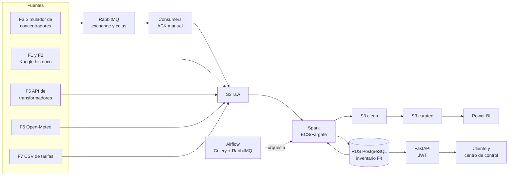
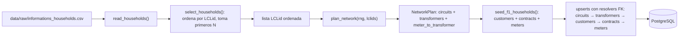
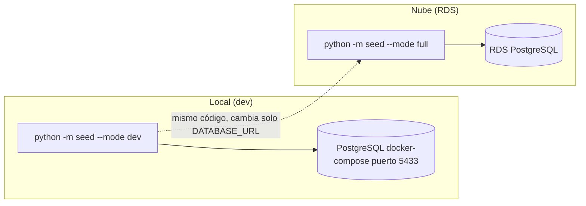

> **Archivo archivado.** Este era el `README.md` completo (español) antes de la reestructuración estilo CoDecide.
> El README actual y resumido vive en [/README.es.md](../README.es.md) (ES) y [/README.md](../README.md) (EN).
> Se conserva aquí para no perder el detalle (arquitectura, reglas RN-01…RN-11, US-01, ADRs) hasta migrarlo a `voltiagrid-docs`.

# VoltiaGrid - Medición Inteligente

Plataforma de datos para Voltia Energía S.A. E.S.P. (comercializadora ficticia con 1,2 millones de clientes). Recibe las lecturas de medidores inteligentes cada 30 minutos, las limpia y completa, calcula el consumo por franja tarifaria, detecta pérdidas y fraude por transformador y gestiona eventos de respuesta a la demanda. Todo termina en un tablero de Power BI y en una demo en vivo desplegada en AWS.

Este es el **Proyecto 04** del programa. Este README documenta la arquitectura completa y la parte del repo `voltagrid-api`.

> Estado del documento: borrador. Lo marcado como **(propuesta)** o **(por decidir)** todavía no está acordado con el equipo y se actualiza a medida que se cierren las decisiones (cada una se documenta como ADR en `voltiagrid-docs`).

## Contenido

1. [Equipo y repositorios](#1-equipo-y-repositorios)
2. [El problema y los números](#2-el-problema-y-los-números)
3. [Arquitectura end-to-end](#3-arquitectura-end-to-end)
4. [Fuentes de datos](#4-fuentes-de-datos)
5. [Plataformas: qué son, por qué y cómo las usamos](#5-plataformas-qué-son-por-qué-y-cómo-las-usamos)
6. [Procesos: qué corre y cuándo](#6-procesos-qué-corre-y-cuándo)
7. [Reglas de negocio](#7-reglas-de-negocio)
8. [Estructura de este repositorio](#8-estructura-de-este-repositorio)
9. [Cómo correr el proyecto](#9-cómo-correr-el-proyecto)
10. [Flujo de trabajo con Git y Jira](#10-flujo-de-trabajo-con-git-y-jira)
11. [Plan de trabajo del backend](#11-plan-de-trabajo-del-backend)
12. [US-01: detalle técnico y trazabilidad (P1)](#12-us-01-detalle-técnico-y-trazabilidad-p1)
13. [Glosario técnico P1 (US-01)](#13-glosario-técnico-p1-us-01)
14. [Decisiones de arquitectura de US-01 (ADRs técnicas)](#14-decisiones-de-arquitectura-de-us-01-adrs-técnicas)
15. [Testing del seed](#15-testing-del-seed)

---

## 1. Equipo y repositorios

| Rol | Responsabilidad |
|---|---|
| P1 - Backend y mensajería | FastAPI, RabbitMQ, simuladores y API |
| P2 - Ingeniería de datos | Spark, reglas de negocio y rendimiento |
| P3 - Cloud y DevOps | Docker, AWS, Airflow, CI/CD y EKS |
| P4 - Arquitectura y analítica | Documentación, ADRs, costos, modelo dimensional y Power BI |

Repositorios de la organización en GitHub:

| Repo | Contenido |
|---|---|
| `voltagrid-api` | FastAPI, simuladores, consumidores de RabbitMQ y seed (este repo) |
| `voltiagrid-data` | Spark, DAGs de Airflow y reglas de negocio |
| `voltiagrid-analytics` | Modelo dimensional y Power BI |
| `voltiagrid-docs` | Arquitectura completa, ADRs, costos y runbook |

Pendientes de decidir con el líder: un repo `voltiagrid-infra` para infraestructura como código, docker-compose y manifiestos de EKS **(propuesta)**, y si el proyecto queda en varios repos o en un monorepo **(por decidir)**.

## 2. El problema y los números

Voltia está reemplazando medidores convencionales por inteligentes. Hoy hay 5.500 medidores piloto y se proyectan 200.000 para el próximo año (36 veces más). Las lecturas llegan con huecos, duplicados y relojes desincronizados, y por eso hoy no se puede aplicar la tarifa horaria, ni localizar pérdidas no técnicas (estimadas en 9%), ni coordinar bien los eventos de respuesta a la demanda.

Objetivos de negocio:

- Facturar el 99% de los clientes piloto con lecturas reales por franja.
- Identificar el 70% de las pérdidas no técnicas a nivel de transformador.
- Ejecutar eventos de respuesta a la demanda midiendo el ahorro real.
- Dejar una plataforma dimensionada y costeada para 200.000 medidores.

Orden de magnitud (calculado con los datos del enunciado):

| Escenario | Medidores | Lecturas por día (48 por medidor) |
|---|---|---|
| Piloto | 5.500 | 264.000 |
| Proyectado | 200.000 | 9.600.000 |
| Reenvío de 24 h (CA-08) | 1.000 | 48.000 de golpe |

## 3. Arquitectura end-to-end

La arquitectura es el diseño de cómo se conectan los componentes, cómo viaja el dato entre ellos y dónde corre cada pieza. No es lo mismo que la organización de los repositorios.



Cómo se lee, de izquierda a derecha:

1. **Generación.** Parte de los datos es real (F1, F2, F6) y parte la simulamos nosotros (F3, F4, F5, F7).
2. **Ingesta.** Las lecturas de los concentradores (F3) entran por RabbitMQ con colas persistentes y ACKs. Un consumidor las guarda tal cual en la capa raw de S3.
3. **Procesamiento.** Spark lee de raw, limpia, deduplica, estima huecos, asigna franjas tarifarias, calcula pérdidas y liquida eventos. Escribe en las capas clean y curated, y deja los resultados que consume la API en PostgreSQL.
4. **Orquestación.** Airflow programa y encadena los procesos.
5. **Exposición.** FastAPI sirve el consumo diario al cliente (autenticado) y la carga por transformador al centro de control.
6. **Analítica.** Un modelo dimensional sobre la capa curated alimenta el tablero de Power BI.

Sobre un dato que se queda sin procesar: el consumidor **no** resuelve los duplicados de negocio (RN-02). Guarda todo lo que llega y la limpieza se hace en Spark, para no perder datos crudos y poder reprocesar.

## 4. Fuentes de datos

| ID | Fuente | Tipo | Frecuencia |
|---|---|---|---|
| F1 | Smart meters in London (Kaggle), ~5.500 hogares y ~167 M de lecturas | CSV real | Histórico único |
| F2 | Clima histórico del mismo dataset | CSV real | Histórico, horario |
| F3 | Lecturas de concentradores (JSON por lote de medidores) | Stream simulado | Cada 30 min |
| F4 | Inventario de red: clientes, medidores, transformadores, circuitos, contratos | BD PostgreSQL simulada (seed) | Diaria |
| F5 | Energía entregada por transformador (~100 transformadores en el piloto) | API REST simulada | Cada 15 min |
| F6 | Pronóstico de temperatura | API pública Open-Meteo | Horaria |
| F7 | Calendario tarifario (punta, intermedia, valle y precio por kWh) | CSV simulado | Trimestral |

Todo lo simulado sale de un **seed**: semilla fija, idempotente, con volumen parametrizable (dev o full) y con los defectos de calidad inyectados a una tasa configurable (nulos o "Null" como texto, duplicados con valores distintos, saltos de reloj, valores negativos o imposibles de más de 25 kWh en 30 min, y medidores que dejan de reportar días completos).

## 5. Plataformas: qué son, por qué y cómo las usamos

### Python
- **Qué es:** el lenguaje en el que están escritos la API, los simuladores y el seed.
- **Por qué:** es el lenguaje del curso, tiene librerías para todo lo que necesitamos (FastAPI, SQLAlchemy, Spark con PySpark, cliente de RabbitMQ) y es el mismo que usan P2 y P3.

### FastAPI
- **Qué es:** un framework de Python para construir APIs REST. Genera solo la documentación OpenAPI/Swagger, valida los datos con modelos tipados y soporta programación asíncrona.
- **Por qué:** es obligatorio en el programa y el entregable E-05 pide el contrato OpenAPI. Es liviano para correr en contenedores. Alternativas descartadas: Flask (menos validación y documentación automática) y Django REST Framework (más pesado de lo que necesitamos).
- **En el proyecto:** dos APIs. Una para el cliente autenticado (consumo diario, p95 de 500 ms o menos, sin ver datos de otros clientes) y una para el centro de control (carga por transformador).

### SQLAlchemy y Alembic
- **Qué es:** SQLAlchemy es un ORM, es decir, deja manejar las tablas como clases de Python. Alembic guarda los cambios del esquema como migraciones versionadas.
- **Por qué:** el ORM es requisito del programa y, con Alembic, la base local y la de RDS quedan con el mismo esquema.
- **En el proyecto:** modelos del inventario de red (cliente, contrato, medidor, transformador, circuito) y migraciones.

### PostgreSQL (local y RDS)
- **Qué es:** base de datos relacional. En AWS la administra el servicio RDS (backups, parches y conexión segura).
- **Por qué:** es la base que pide el enunciado para F4 y RDS. Es la misma en local y en la nube.
- **En el proyecto:** guarda el inventario de red (F4) y los resultados que consume la API.

### RabbitMQ
- **Qué es:** un broker de mensajería. El productor deja los mensajes en colas y los consumidores los procesan a su ritmo, de forma desacoplada.
- **Por qué:** es obligatorio en el programa y resuelve el requisito de cero lecturas perdidas con reenvíos masivos (RNF-03): colas persistentes y ACK manual. La cola amortigua los picos sin tener que sobredimensionar. También sirve de broker de Celery para Airflow, así que un solo broker cubre dos usos. Alternativas: Kafka (más pesado y caro para 264.000 lecturas diarias; se revisa si se escala a 200.000 medidores) y SQS (no tiene exchanges ni routing keys).
- **En el proyecto:**
  - Exchange `topic` llamado `lecturas`, con routing keys `lecturas.vivo` y `lecturas.reenvio` **(propuesta)**.
  - Dos colas durables, una por tipo de tráfico, para que un reenvío de 48.000 lecturas no atrase las lecturas normales.
  - Mensajes persistentes, publisher confirms y ACK manual: el consumidor confirma solo después de guardar el dato.
  - Una `message_id` por mensaje para ignorar los repetidos.
  - Una cola de mensajes muertos (DLQ) para los mensajes malformados o que fallan varias veces.
  - Si la cola de reenvíos crece, se suben temporalmente los consumidores y se bajan al terminar.

### Docker y docker-compose
- **Qué es:** Docker empaqueta cada componente en una imagen reproducible. docker-compose levanta varios contenedores juntos con redes y volúmenes.
- **Por qué:** es requisito (CT-01): todo el ecosistema local debe levantar con un solo comando y un README que permita a una persona externa ejecutarlo en menos de 30 minutos.
- **En el proyecto:** imágenes de la API, simuladores y consumidores, con variables de entorno, `.dockerignore` y evidencia de optimización de tamaño.

### Apache Spark y Parquet
- **Qué es:** Spark es un motor de procesamiento distribuido. Parquet es un formato de archivo columnar y comprimido.
- **Por qué:** F1 son unos 167 millones de lecturas, demasiadas para procesarlas con herramientas normales. Parquet es rápido de leer para analítica y ocupa menos espacio.
- **En el proyecto (P2):** esquemas explícitos (no inferidos), normalización de intervalos, deduplicación con prioridad, estimación de huecos, asignación de franjas, pérdidas y liquidación de eventos, particionado por fecha.

### Apache Airflow (CeleryExecutor)
- **Qué es:** un orquestador. Define los procesos como DAGs (grafos de tareas con dependencias, reintentos y horarios).
- **Por qué:** necesitamos programar y reintentar el cierre diario y los procesos cada 30 minutos. Con Celery y RabbitMQ las tareas se reparten entre varios workers.
- **En el proyecto (P3):** DAGs para el cierre diario (menos de 45 minutos), la carga del histórico y los procesos de 30 minutos.

### Amazon S3 (Data Lake)
- **Qué es:** almacenamiento de objetos barato y duradero.
- **Por qué:** retener 3 años de lecturas al menor costo, usando clases de almacenamiento justificadas.
- **En el proyecto:** capas raw (tal cual llegó), clean (limpio y validado) y curated (listo para analítica).

### AWS: VPC, IAM, ECR, ECS/Fargate, ALB
- **Qué son:** VPC es la red propia (subredes, rutas, security groups). IAM es la gestión de permisos. ECR es el registro privado de imágenes. ECS/Fargate corre contenedores sin administrar servidores. ALB es el balanceador de carga con health checks.
- **Por qué:** son requisitos del programa y encajan con una arquitectura de contenedores. Fargate permite pagar solo mientras corre el trabajo, por ejemplo el cierre diario.
- **En el proyecto (P3):** red propia, IAM de mínimo privilegio, imágenes en ECR, la API detrás de un ALB y Spark ejecutado en Fargate reportando tiempo y costo por ejecución. Toda la infraestructura etiquetada (proyecto, ambiente, responsable) y destruible/recreable, preferiblemente con IaC (Terraform o CloudFormation, **por decidir**).

### EKS (Kubernetes)
- **Qué es:** Kubernetes administrado por AWS.
- **Por qué:** el programa pide al menos un componente en Kubernetes y una comparación ECS vs EKS para este caso.
- **En el proyecto (P3):** un componente desplegado con Pods, Deployments, Services y namespaces **(componente por decidir)**.

### CI/CD
- **Qué es:** un pipeline automático que revisa y despliega el código en cada cambio.
- **Por qué:** bloquea el merge a la rama principal si fallan lint, pruebas o validación de DAGs, y debe detectar secretos (CT-02 y CT-04).
- **En el proyecto:** pipeline de aplicación (lint, pruebas, build de imágenes, publicación y despliegue) y de datos (pruebas de jobs, validación de DAGs, calidad de datos). La herramienta (por ejemplo GitHub Actions) y el detector de secretos están **por decidir**.

### Observabilidad
- **Qué es:** logs, métricas y alarmas para saber qué está pasando.
- **Por qué:** es requisito tener al menos una alarma demostrada en vivo ante una falla provocada (CT-09).
- **En el proyecto:** logs centralizados, métricas como el tamaño de las colas y el tiempo del cierre diario, y alarmas con umbrales definidos **(herramienta por decidir; en AWS lo natural sería CloudWatch)**.

### Power BI y modelo dimensional
- **Qué es:** el modelo dimensional organiza los datos en tablas de hechos y dimensiones. Power BI es la herramienta de tablero.
- **Por qué:** hay seis preguntas de negocio que el tablero debe responder y cuyos números deben cuadrar con una consulta de control.
- **En el proyecto (P4):** hechos de consumo, pérdidas y eventos; dimensiones de cliente, medidor, transformador, tiempo, franja y clima.

### GitHub y Jira
- **Qué son:** GitHub aloja el código y los Pull Requests; Jira gestiona las historias de usuario y tareas.
- **Por qué:** el flujo con ramas y PR revisados es parte de la evidencia que pide el programa (E-02 y CI/CD I).

## 6. Procesos: qué corre y cuándo

Esta división es una **propuesta** que responde a una de las preguntas del enunciado y debe revisarse con P2 y P3.

**Continuos / cada 30 minutos**
- Ingesta de lecturas de concentradores por RabbitMQ (los consumidores siempre están encendidos).
- Validación y estimación incremental de la última ventana de lecturas.
- Evaluación de eventos de respuesta a la demanda (RN-08), con el pronóstico de temperatura y la carga proyectada.

**Cada 15 minutos / cada hora**
- Captura de la energía por transformador de F5 (cada 15 min).
- Captura del pronóstico de Open-Meteo (cada hora).

**Diarios**
- Cierre diario (menos de 45 minutos): validación, estimación y agregación.
- Cálculo de pérdidas por transformador y evaluación de medidores sospechosos (RN-06 y RN-07).
- Actualización del inventario de red (F4).

**Mensuales / trimestrales**
- Consumo mensual por franja y cliente, con el indicador de lecturas estimadas y las órdenes de inspección (RN-03 y RN-04).
- Liquidación de incentivos (RN-09 y RN-10).
- Reporte trimestral regulatorio de pérdidas y calidad de medición; actualización del calendario tarifario (F7).

**Bajo demanda**
- Carga del histórico completo de F1 en la nube.
- Reprocesos de un periodo (deben ser idempotentes: re-ejecutar no duplica ni corrompe datos).
- Absorción de reenvíos masivos tras un corte.
- Seed de datos, simulación de ola de calor e inyección de pérdidas para la demo y el caso de pérdidas.

## 7. Reglas de negocio

Cada regla debe estar en el código y tener al menos una prueba automatizada.

| ID | Resumen |
|---|---|
| RN-01 | Normalizar las lecturas a :00 o :30 si la desviación es de 5 min o menos; si es mayor, marcar "reloj inválido". |
| RN-02 | Ante duplicados del mismo medidor e intervalo, gana la lectura con mayor número de secuencia. |
| RN-03 | Huecos de hasta 2 h se estiman por interpolación lineal; los más largos con el perfil de las últimas 4 semanas. Toda estimación queda marcada. |
| RN-04 | Un cliente con más del 10% de lecturas estimadas en el mes no se factura y se genera orden de inspección. |
| RN-05 | Asignar cada intervalo a la franja tarifaria vigente en la fecha (F7). |
| RN-06 | Pérdida de transformador = energía entregada − suma del consumo de sus medidores. Si supera el 12% durante 3 días seguidos, queda sospechoso. |
| RN-07 | Medidor sospechoso: consumo cero por 48 h o más en un transformador sospechoso, o caída de más del 60% frente a su promedio de 8 semanas sin cambio de contrato. |
| RN-08 | Evento de respuesta a la demanda: pronóstico mayor a 30 °C y carga proyectada mayor al 85% de la capacidad del circuito. Máximo 3 h y solo en punta. |
| RN-09 | Incentivo solo si el ahorro frente a la línea base es del 10% o más. |
| RN-10 | Máximo 8 eventos por cliente al mes. |
| RN-11 | Los datos de un cliente solo los consulta él mismo y las áreas autorizadas. |

## 8. Estructura de este repositorio

Estructura **planeada** para `voltagrid-api` (se va creando a medida que avanzan las historias de usuario):

```
voltagrid-api/
├── app/
│   ├── api/            # routers de FastAPI (cliente y centro de control)
│   ├── services/       # lógica de negocio
│   ├── repositories/   # acceso a la base de datos
│   ├── models/         # modelos ORM (SQLAlchemy)
│   ├── schemas/        # contratos de entrada y salida (Pydantic)
│   └── core/           # configuración, seguridad y JWT
├── simulators/         # F3 concentradores y F5 API de transformadores
├── seed/               # scripts de siembra de datos (F4)
├── migrations/         # migraciones de Alembic
├── tests/
├── docker-compose.yml
├── Dockerfile
├── .env.example        # variables de entorno de ejemplo, sin secretos
└── README.md
```

La API sigue una estructura por capas (routers → services → repositories → models/schemas) para poder probar cada capa por separado y mantener el código entre varias personas.

## 9. Cómo correr el proyecto

Esta sección se completa cuando exista el código. El objetivo (CT-01) es:

```bash
cp .env.example .env
docker compose up
```

y que una persona externa lo ejecute en menos de 30 minutos.

Parámetros del seed (variables de entorno o CLI):

| Variable | Qué hace |
|---|---|
| `SEED` | Semilla fija para que los datos sean reproducibles. |
| `MODE` | `dev` (volumen pequeño) o `full` (5.500 medidores). |
| `DEFECT_RATE` | Tasa de defectos de calidad a inyectar. |
| `DATABASE_URL` | Conexión a PostgreSQL local o a RDS, sin cambiar código. |

Ninguna credencial va en el repositorio ni en las imágenes (CT-02): se usan variables de entorno y el pipeline falla si detecta secretos.

## 10. Flujo de trabajo con Git y Jira

La clave de Jira se escribe **en mayúsculas** en tres lugares para que Jira conecte todo automáticamente:

- Rama: `feature/KAN-12-mqtt-ingestion`
- Commit: `KAN-12 add meter reading consumer`
- Título del PR: `KAN-12 Meter reading consumer`

También existen los Smart Commits (`KAN-12 #done`, `KAN-12 #comment listo para revisión`), que solo funcionan si el correo de `git config user.email` coincide con el de la cuenta de Jira.

El merge a la rama principal pasa por Pull Request revisado y con el CI en verde.

## 11. Plan de trabajo del backend

Semana 1: arquitectura v1, modelo de datos operativo y seed funcionando (E-01, E-02, E-03).

**US-01 - Seed reproducible del inventario de red (F4)**

- AC1 Reproducibilidad: con la misma semilla, correr el seed dos veces produce datos idénticos y sin filas duplicadas.
- AC2 Modos de volumen: `MODE=dev` o `MODE=full` crean el número de medidores configurado (5.500 en full).
- AC3 Consistencia: cada medidor tiene un `LCLid` válido de F1 y cada transformador tiene entre 50 y 80 medidores.
- AC4 Portabilidad: funciona con PostgreSQL local o RDS cambiando solo `DATABASE_URL`.

| Tarea | Descripción |
|---|---|
| T-01.1 | Diseñar el ERD del inventario (incluye la capacidad de circuito y transformador). |
| T-01.2 | Modelos ORM con SQLAlchemy y migraciones con Alembic. |
| T-01.3 | Generar clientes y medidores desde los `LCLid` de F1, conservando grupo ACORN y tipo de tarifa. |
| T-01.4 | Asignar medidores a transformadores (50-80 por transformador) y transformadores a circuitos. |
| T-01.5 | Inserción idempotente con upsert por clave natural. |
| T-01.6 | Parámetros por CLI y variables de entorno: `SEED`, `MODE`, `DEFECT_RATE`, `DATABASE_URL`. |
| T-01.7 | Prueba automatizada que compara el hash de las tablas en dos corridas con la misma semilla (CT-06). |

Las siguientes historias (simulador F3, productor y consumidor de RabbitMQ, API del cliente con JWT, API del centro de control y simulador F5) se agregan aquí a medida que se creen en Jira.

## Upsert por Clave Natural (Idempotent Seeding)

Utilidad reutilizable en `seed/upsert.py`:

```python
from seed.upsert import upsert_by_natural_key

# DO NOTHING (entidades inmutables)
upsert_by_natural_key(session, Circuit, records, natural_key="code")

# DO UPDATE (actualiza FKs si cambian)
upsert_by_natural_key(
    session, Meter, records,
    natural_key="lclid",
    update_fields=["transformer_id", "customer_id"],
    fk_resolver=resolve_meter_fks
)
```

Estrategia por entidad (KAN-14):

| Entidad | Clave natural | Conflicto | `update_fields` |
|---|---|---|---|
| `circuit` | `code` | `DO NOTHING` | — |
| `transformer` | `code` | `DO NOTHING` | — (resuelve `circuit_code` → `circuit_id` antes) |
| `customer` | `code` | `DO NOTHING` | — |
| `contract` | `code` | `DO NOTHING` | — (resuelve `customer_code` → `customer_id` antes) |
| `meter` | `lclid` | `DO UPDATE` | `transformer_id`, `customer_id` (resuelve códigos → IDs antes) |

## 12. US-01: detalle técnico y trazabilidad (P1)

Estado: **US-01 completada** (KAN-12 a KAN-16). Alcance P1: seed F4, modelos, migraciones, CLI, tests.

### Pipeline del seed (`seed/__main__.py`)



Orden de escritura en BD (respeta FKs): `circuits` → `transformers` (`flush`) → `customers` → `contracts` (`flush`) → `meters` (`commit`).

### Despliegue del seed (local vs RDS)



### Trazabilidad AC → test → código

| AC | Qué exige | Dónde está implementado | Test que lo verifica |
|---|---|---|---|
| AC1 Reproducibilidad | Misma semilla → datos idénticos, 0 duplicados | `seed/__main__.py`, `seed/upsert.py`, `seed/network.py` (RNG aislado) | `tests/test_reproducibility.py::test_seed_reproducibility` (hash MD5 por tabla, 2 corridas), `tests/test_upsert.py::test_seed_full_idempotent`, `::test_deterministic_assignment` |
| AC2 Modos de volumen | `dev`=200, `full`=5500 medidores | `seed/config.py` (`METERS_BY_MODE`), CLI `--mode`, env `MODE` | `test_meter_counts_per_transformer_range` (suma total), verificación manual `--mode dev/full` |
| AC3 Coherencia de red | `LCLid` válido F1; 50–80 medidores por transformador | `seed/f1.py` (`select_households`, `build_meter`), `seed/network.py` (`plan_network`, bloques contiguos) | `tests/test_upsert.py::test_meter_counts_per_transformer_range`, `::test_upsert_meter_fk_integrity` |
| AC4 Portabilidad | Funciona en Postgres local o RDS con solo `DATABASE_URL` | `seed/config.py` (`build_settings`: CLI > env > default), `docker-compose.yml`, `.env.example` | Configuración validada en seed (`--database-url` o env), `tests/conftest.py` usa `DATABASE_URL` |

### Reglas de determinismo aplicadas (CT-06)

- RNG aislado: `rng = random.Random(settings.seed)`; nunca `random.seed()` global.
- LCLids ordenados antes de asignar (`select_households` ordena por `LCLid`; `dev` es subconjunto exacto de `full`).
- Códigos deterministas: `TR-%05d`, `CT-%03d`, `CU-{LCLid}`, `CT-{LCLid}-1`; sin `uuid4()` ni `datetime.now()`.
- Sin `created_at`: evita columnas que cambien por corrida y romperían el hash (ver `docs/erd.md`).
- Idempotencia: `ON CONFLICT DO NOTHING` (circuit/transformer/customer/contract) y `DO UPDATE` de FKs (meter).

### Cómo verificar US-01

```bash
cp .env.example .env
docker compose up -d
alembic upgrade head
python -m seed --mode dev --seed 42 --defect-rate 0
python -m seed --mode dev --seed 42 --defect-rate 0  # segunda corrida: 0 duplicados
python -m pytest tests/ -v  # en Docker si psycopg local falla en Windows
```

## 13. Glosario técnico P1 (US-01)

| Término | Qué significa | Dónde aparece |
|---|---|---|
| `LCLid` | Identificador natural del hogar/medidor en F1 (ej. `MAC000002`). Clave natural de `meter`. | `seed/f1.py`, `meter.lclid` |
| ACORN / `acorn_grouped` | Clasificación socioeconómica del hogar. `acorn_group` = valor crudo F1; `acorn_grouped` = valor normalizado con `CHECK (Affluent, Comfortable, Adversity, Unknown)`. | `Customer`, migración `cb10f7277f53` |
| `stdorToU` / `tariff_type` | Tarifa del contrato en F1 (`Std`/`ToU`) mapeada a (`standard`/`dynamic`) con `CHECK`. | `seed/f1.py::map_tariff`, `Contract` |
| Clave natural | Columna única de negocio usada para identificar filas (`code`, `lclid`). Base del upsert. | `docs/erd.md`, `seed/upsert.py` |
| Upsert idempotente | `INSERT ... ON CONFLICT`: `DO NOTHING` (no duplica) o `DO UPDATE` (actualiza FKs). Re-ejecutar no corrompe. | `seed/upsert.py`, KAN-14 |
| RNG aislado | Instancia propia `random.Random(seed)` en vez de estado global. Evita que otras librerías alteren la secuencia. | `seed/__main__.py::_rng_from_seed`, `seed/network.py` |
| `defect_rate` | Tasa 0–1 de defectos de calidad a inyectar. En test CT-06 se usa `0.0` para comparar hashes. | `seed/config.py` |
| `MODE dev/full` | Volumen parametrizable: `dev`=200, `full`=5500 medidores. `dev` = primeros N ordenados = subconjunto de `full`. | `seed/config.py` |
| FK resolver | Función que convierte códigos (`circuit_code`) a IDs (`circuit_id`) consultando la BD antes del upsert. | `seed/__main__.py::_resolve_*` |
| `NetworkPlan` | Dataclass con `circuits`, `transformers`, `meter_to_transformer` (`{lclid: transformer_code}`). | `seed/network.py` |
| CT-06 | Criterio transversal: prueba automatizada que compara hash de tablas en 2 corridas con misma semilla. | `tests/test_reproducibility.py` |
| F4 | Inventario de red (clientes, medidores, transformadores, circuitos, contratos). Lo puebla el seed. | `app/models/inventory.py` |

## 14. Decisiones de arquitectura de US-01 (ADRs técnicas)

> Las ADRs formales del programa viven en `voltiagrid-docs` (P4). Aquí quedan las decisiones técnicas de US-01 (P1) con contexto y consecuencia.

| ID | Decisión | Contexto | Consecuencia |
|---|---|---|---|
| ADR-US01-01 | PostgreSQL + SQLAlchemy 2.0 + Alembic para F4 | Requisito del programa; mismo esquema local y RDS | Modelos tipados (`Mapped`), migraciones versionadas; autogenerate detecta columnas pero el `CHECK` se agrega a mano |
| ADR-US01-02 | Upsert por clave natural (`ON CONFLICT`) en vez de `session.merge()` | Re-ejecuciones frecuentes; claves naturales estables (`code`, `lclid`) | Idempotencia a nivel BD; `DO NOTHING` para inmutables, `DO UPDATE` solo de FKs en `meter` |
| ADR-US01-03 | RNG aislado `random.Random(seed)` | Librerías externas pueden usar `random` global y romper reproducibilidad | Secuencia determinista por seed; CT-06 pasa |
| ADR-US01-04 | `seed/network.py` separado de `seed/f1.py` | `f1.py` = hogares (datos CSV); `network.py` = topología (algoritmo) | Separación de responsabilidades; topología reutilizable para otros datasets |
| ADR-US01-05 | Sin `created_at` / sin `uuid4()` / sin `now()` en seed | Cualquier valor no determinista cambia el hash entre corridas | Hash estable; `dev` subconjunto exacto de `full` |
| ADR-US01-06 | Tests con transacción + `rollback` | Aislamiento sin recrear BD; misma `DATABASE_URL` | Cada test deja la BD limpia; rápido y portable |
| ADR-US01-07 | Capacidades en rangos aleatorios (TX 100–500, CT 1000–5000 kVA) | Equipo pidió "datos reales pero en rangos" | Valores plausibles sin dataset externo; deterministas por RNG |

## 15. Testing del seed

```bash
# En Docker (recomendado en Windows por psycopg):
docker run --rm --network host -v "<ruta>/voltiagrid-api:/app" -w /app python:3.12-slim bash -c "pip install -r requirements.txt -q && python -m pytest tests/ -v"
```

| Test | Qué verifica |
|---|---|
| `test_upsert_circuit_do_nothing` | `DO NOTHING` no duplica `circuit` |
| `test_upsert_transformer_do_nothing_with_fk` | `DO NOTHING` + resolver `circuit_code` → `circuit_id` |
| `test_upsert_meter_do_update` | `DO UPDATE` cambia `transformer_id` en conflicto de `lclid` |
| `test_upsert_meter_fk_integrity` | FKs resueltos existen (sin huérfanos) |
| `test_seed_full_idempotent` | Upsert idempotente por entidad |
| `test_deterministic_assignment` | Misma seed → mismos `TR`/`CT` y mapa meter→transformer |
| `test_meter_counts_per_transformer_range` | 50–80 por transformador (último puede llevar el resto) |
| `test_seed_reproducibility` (CT-06) | Hash MD5 idéntico en 2 corridas (`circuit`, `transformer`, `customer`, `contract`, `meter`) |

> Nota Windows: `psycopg`/`psycopg-binary` pueden ser bloqueados por Application Control. Por eso los tests y el seed se validan en contenedor `python:3.12-slim` con `--network host`.
