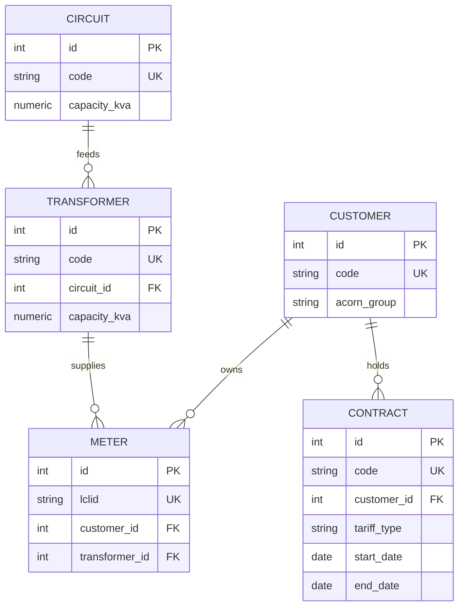

# ERD del inventario de red (F4)

Diagrama entidad-relación de la base de inventario que puebla el seed (US-01, KAN-9). Corresponde a la tarea T-01.1 (KAN-10).

## Diagrama

## Tablas

| Tabla | Para qué sirve | Clave natural (para el upsert) |
|---|---|---|
| `circuit` | Circuito eléctrico con su capacidad. RN-08 compara la carga proyectada contra el 85% de esta capacidad. | `code` |
| `transformer` | Transformador que pertenece a un circuito y tiene su propia capacidad. RN-06 calcula las pérdidas por transformador y el centro de control consulta su carga. | `code` |
| `customer` | Cliente (hogar) con su grupo socioeconómico ACORN, que usa el tablero para analizar el consumo. | `code` (derivado del `LCLid`) |
| `contract` | Contrato del cliente con su tipo de tarifa y las fechas de vigencia. RN-07 necesita saber si hubo cambio de contrato. | `code` |
| `meter` | Medidor inteligente, identificado por el `LCLid` de F1, conectado a un transformador y a un cliente. | `lclid` |

## Relaciones

- Un circuito alimenta muchos transformadores (`circuit` 1 → N `transformer`).
- Un transformador suministra a muchos medidores (`transformer` 1 → N `meter`). Regla de la US-01 (AC3): entre 50 y 80 medidores por transformador.
- Un cliente es dueño de uno o más medidores (`customer` 1 → N `meter`). En el piloto es un medidor por cliente, pero el modelo no lo limita.
- Un cliente tiene uno o más contratos a lo largo del tiempo (`customer` 1 → N `contract`).

## Campos importantes

| Campo | Tipo sugerido | Nota |
|---|---|---|
| `capacity_kva` | `NUMERIC(8,2)` | Capacidad en kVA, en `circuit` y en `transformer`. |
| `lclid` | `VARCHAR(20)` | Identificador de F1 (por ejemplo `MAC000002`). |
| `acorn_group` | `VARCHAR(30)` | Grupo ACORN tal como viene en F1. |
| `tariff_type` | `VARCHAR(20)` | `standard` o `dynamic` (tarifa estándar o dinámica en F1). |
| `start_date`, `end_date` | `DATE` | `end_date` queda vacío mientras el contrato esté vigente. |

## Decisiones de diseño

- **Clave primaria `id` y clave natural única.** Cada tabla tiene un `id` interno, pero el seed identifica cada fila por su clave natural (`code` o `lclid`). Esa clave natural es la que hace posible el upsert idempotente de T-01.5 (`INSERT ... ON CONFLICT`).
- **Claves naturales deterministas.** Se generan con una regla fija, como `TR-001`, `CI-01` o `CU-<LCLid>`, sin números aleatorios ni fechas actuales. Así la misma semilla produce siempre los mismos datos (AC1).
- **Sin campos de fecha de creación.** No se agregan columnas como `created_at` con valor por defecto, porque cambiarían en cada corrida y romperían la prueba de hash de T-01.7.
- **Capacidad en circuito y transformador.** Lo pide la tarea T-01.1 y la usan RN-06 y RN-08.
- **ACORN en `customer` y tarifa en `contract`.** El grupo ACORN describe al hogar. El tipo de tarifa es una condición del contrato, que puede cambiar en el tiempo y de la que depende RN-07.
- **El rango de 50 a 80 medidores por transformador no se impone con una restricción de la base de datos.** Lo garantiza la generación del seed (T-01.4) y lo verifica una prueba automatizada, porque una restricción de ese tipo complicaría la carga.

## Fuera de este ERD

- Las **lecturas de medidores** (F3, F1) no están en esta base: viven en el Data Lake (S3) y las procesa Spark.
- Las **tarifas por franja (F7)** son un CSV aparte.
- Los **concentradores** no aparecen porque F4 no los incluye. Si el simulador F3 o P2 necesitan agrupar medidores por concentrador, se agregaría una columna o una tabla en `meter` más adelante.

## Trazabilidad

F4, E-03, CT-06. Soporta AC1 a AC4 de la US-01 y las reglas RN-06, RN-07 y RN-08.
